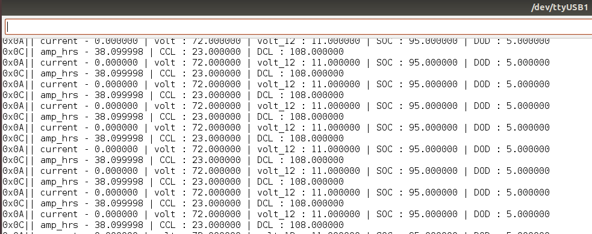
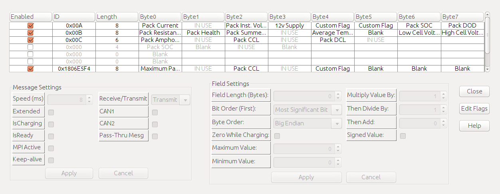

# VRE CAN Data Logger




OrionBMS has been setup to send out data over CAN.
This data includes : current, volt, volt_12, SOC, DOD, resistance, health, summed_volt, avg_temp, low_volt_id, high_volt_id, amp_hrs, CCL, DCL, live_cell_voltages [pack_id, internal_volt, resistance, open_volt]. The above can be set in the OrionBMS software.




This data becomes vital for testing and debugging issues on the car. The above system has been implemented for the ESP32's CAN module

## Getting Started

Clone the repository to your Arduino directory:

```bash
cd ~/Arduino
git clone https://github.com/AdityaNG/VRE_CAN
```

Open up Arduino and open the sketch 'VRE_CAN'

## Dependencies 

- [ESP32CAN](https://www.arduino.cc/reference/en/libraries/can/)
- [CAN transceiver Module](https://www.amazon.in/xcluma-Sn65Hvd230-Transceiver-Communication-Module/dp/B072TCPSB1/ref=sr_1_2?dchild=1&keywords=CAN+transceiver&qid=1612928097&sr=8-2)
